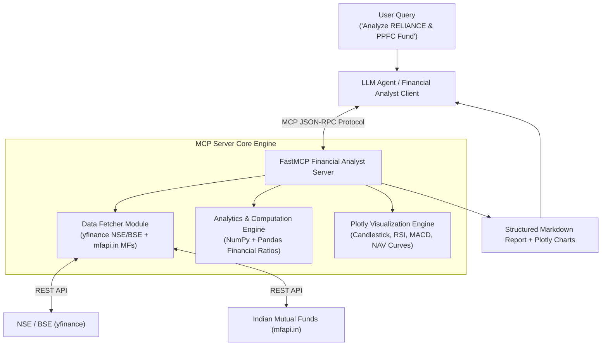
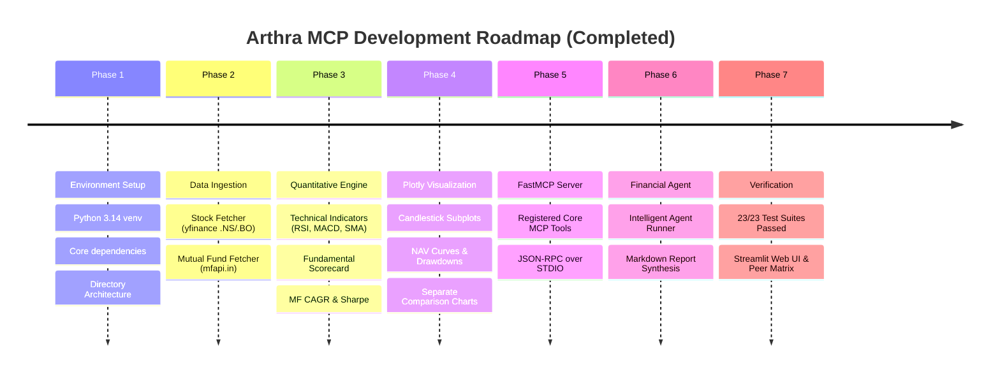

# Arthra MCP 📈🇮🇳
> **Model Context Protocol (MCP) Financial Analyst for Indian Stocks & Mutual Funds**

**Arthra MCP** is a local, AI-powered financial analyst engine built using the **Model Context Protocol (MCP)**. It bridges Large Language Models (LLMs) with Indian equity markets (NSE/BSE via `yfinance`) and Indian Mutual Funds (AMFI via `mfapi.in`), providing statistical calculations, technical indicators, fundamental scorecard analysis, and interactive Plotly visual charts without hallucinated numbers.

---

## 🌟 Architecture & Flow



---

## ✨ Features (All 7 Phases Implemented)

- **📈 Indian Equities Data Engine**: Fetch real-time quotes, historical OHLCV data, valuation ratios, balance sheets, and cash flow statements for NSE (`.NS`) and BSE (`.BO`) stocks.
- **🏦 Mutual Funds Data Engine**: Query latest NAVs, historical performance, category benchmarks, and fund details for all Indian Mutual Fund schemes via AMFI.
- **🧮 Quantitative Analytics Engine**:
  - **Technicals**: Moving Averages (SMA/EMA), RSI (14), MACD, Bollinger Bands, Beta relative to NIFTY 50 (`^NSEI`).
  - **Fundamentals**: Health scorecard (P/E, P/B, EV/EBITDA, ROE, ROCE, Debt to Equity).
  - **Mutual Funds**: CAGR (1Y, 3Y, 5Y, Inception), Rolling Returns, Volatility, Sharpe Ratio, Sortino Ratio, and Max Drawdown.
- **📊 Interactive Plotly Visualizations**: Candlestick charts with technical overlays, fundamental trend bands, mutual fund NAV trajectories, and separate stock & mutual fund comparison charts.
- **🖥️ Streamlit Web Dashboard UI**: Feature-rich web application (`app.py`) featuring single stock analytics, mutual fund analytics, multi-asset benchmark comparisons, peer fundamental matrices, and interactive AI agent chat.
- **🏢 Stock Peer Comparison Matrix**: Side-by-side valuation & fundamental metric comparison table (P/E, P/B, EV/EBITDA, Market Cap, 100-Point Scorecard) with comparative bar visualizers.
- **🔌 FastMCP Tools Protocol**: Exposes clean MCP tools (`search_indian_symbol`, `fetch_financial_data`, `analyze_and_visualize`, `compare_assets`) for host clients like Claude Desktop, Cursor, or CLI Agents.
- **🤖 Autonomous Financial Agent**: Synthesizes executive markdown research reports saved in `reports/` with embedded interactive Plotly chart links.

---

## 🚀 Development Roadmap



---

## 🛠️ Project Structure

```text
mcp_financal_analyst/
├── docs/
│   ├── info.txt         # Project vision & specification
│   ├── plan.md          # Master architecture plan & diagrams
│   ├── phase_1.md       # Phase 1: Environment & Architecture
│   ├── phase_2.md       # Phase 2: Data Ingestion Engine
│   ├── phase_3.md       # Phase 3: Quantitative Engine
│   ├── phase_4.md       # Phase 4: Plotly Visualization Engine
│   ├── phase_5.md       # Phase 5: FastMCP Server Implementation
│   ├── phase_6.md       # Phase 6: Financial Analyst Agent
│   └── phase_7.md       # Phase 7: Testing & Verification
├── images/
│   └── image.png        # System architecture reference diagram
├── src/
│   ├── data/            # stock_fetcher.py & mf_fetcher.py
│   ├── analytics/       # technicals.py, fundamentals.py & mf_analytics.py
│   ├── visualization/   # chart_builder.py
│   ├── mcp_server/      # server.py & tools.py
│   └── agent/           # agent.py
├── demo_client/         # Live demo client scripts
├── charts/              # Output storage for interactive Plotly HTML charts
├── reports/             # Output storage for generated markdown research reports
├── tests/               # 23 automated unit and integration tests
├── app.py               # Streamlit Web Dashboard UI & Peer Matrix
├── main.py              # CLI Entry point & MCP server launcher
├── TODO.md              # Granular task tracker
└── README.md
```

---

## 💻 Quick Start & Commands

### 1. Setup Virtual Environment
```bash
python3 -m venv .venv
source .venv/bin/activate
pip install -r requirements.txt
```

### 2. Run Test Suite
```bash
python -m pytest tests/
```

### 3. Launch Streamlit Web Dashboard UI
```bash
streamlit run app.py
```
*(Automatically opens the interactive web dashboard at http://localhost:8501)*

### 4. Run FastMCP Server (For Claude Desktop / Cursor)
```bash
python main.py --server
```

### 5. Run Financial Analyst Agent via CLI
```bash
# Analyze any Indian Stock
python main.py --agent "Analyze Reliance Industries"

# Analyze any Indian Mutual Fund
python main.py --agent "Analyze Parag Parikh Flexi Cap Fund"

# Interactive prompt mode
python main.py
```

### 5. View Generated Interactive HTML Charts
```bash
# Open charts in browser
open charts/RELIANCE_NS_technical.html
open charts/stock_comparison.html
open charts/mf_comparison.html
```

---

## 📑 Detailed Documentation Index

- [docs/full_project_flow.md](docs/full_project_flow.md) — Exhaustive End-to-End System Flow, Sequence Diagrams, & Math Formulas
- [docs/plan.md](docs/plan.md) — Master Architecture & Flow Diagrams
- [docs/phase_1.md](docs/phase_1.md) — Phase 1: Environment Setup
- [docs/phase_2.md](docs/phase_2.md) — Phase 2: Data Ingestion Engine
- [docs/phase_3.md](docs/phase_3.md) — Phase 3: Quantitative Analytics Engine
- [docs/phase_4.md](docs/phase_4.md) — Phase 4: Plotly Visualization Engine
- [docs/phase_5.md](docs/phase_5.md) — Phase 5: FastMCP Server Implementation
- [docs/phase_6.md](docs/phase_6.md) — Phase 6: Financial Analyst Agent
- [docs/phase_7.md](docs/phase_7.md) — Phase 7: Testing & Verification
- [TODO.md](TODO.md) — Complete Project Progress Tracker

---

## 📜 License

MIT License. Developed for Indian Stock & Mutual Fund Financial Analysis powered by MCP.
