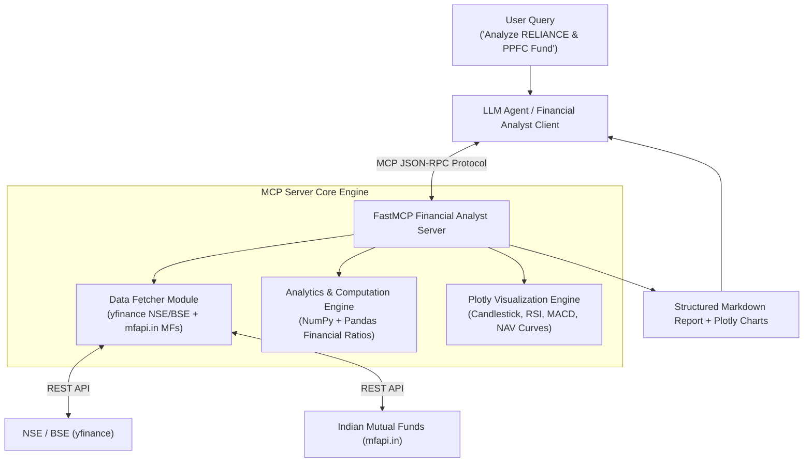
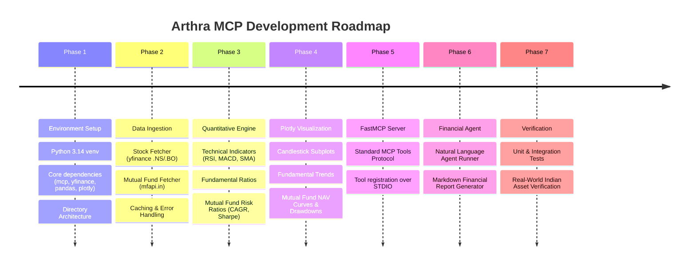

# Arthra MCP 📈🇮🇳
> **Model Context Protocol (MCP) Financial Analyst for Indian Stocks & Mutual Funds**

**Arthra MCP** is a local, AI-powered financial analyst engine built using the **Model Context Protocol (MCP)**. It bridges Large Language Models (LLMs) with Indian equity markets (NSE/BSE via `yfinance`) and Indian Mutual Funds (AMFI via `mfapi.in`), providing statistical calculations, technical indicators, fundamental scorecard analysis, and interactive Plotly visual charts without hallucinated numbers.

---

## 🌟 Architecture & Flow



---

## ✨ Features (Planned & In Progress)

- **📈 Indian Equities Data Engine**: Fetch real-time quotes, historical OHLCV data, valuation ratios, balance sheets, and cash flow statements for NSE (`.NS`) and BSE (`.BO`) stocks.
- **🏦 Mutual Funds Data Engine**: Query latest NAVs, historical performance, category benchmarks, and fund details for all Indian Mutual Fund schemes via AMFI.
- **🧮 Quantitative Analytics Engine**:
  - **Technicals**: Moving Averages (SMA/EMA), RSI (14), MACD, Bollinger Bands, Beta relative to NIFTY 50 (`^NSEI`).
  - **Fundamentals**: Health scorecard (P/E, P/B, EV/EBITDA, ROE, ROCE, Debt to Equity).
  - **Mutual Funds**: CAGR (1Y, 3Y, 5Y), Rolling Returns, Volatility, Sharpe Ratio, Sortino Ratio, and Max Drawdown.
- **📊 Interactive Plotly Visualizations**: Candlestick charts with technical overlays, fundamental trend bands, mutual fund NAV trajectories, and multi-asset relative return comparisons.
- **🔌 FastMCP Tools Protocol**: Expose clean MCP tools (`search_indian_symbol`, `fetch_financial_data`, `analyze_and_visualize`, `compare_assets`) for host clients like Claude Desktop, Cursor, or CLI Agents.

---

## 🚀 Execution Roadmap



---

## 🛠️ Project Structure (Initial Setup)

```text
mcp_financal_analyst/
├── docs/
│   ├── info.txt         # Project vision & specification
│   └── plan.md          # Detailed phase-wise technical plan & diagrams
├── images/
│   └── image.png        # Workflow architectural reference
├── src/                 # (Phase 1-6 Implementation)
│   ├── data/            # Stock & Mutual Fund fetchers
│   ├── analytics/       # Quantitative technicals & fundamentals
│   ├── visualization/   # Plotly chart builders
│   ├── mcp_server/      # FastMCP tools & server runner
│   └── agent/           # LLM agent client interface
├── charts/              # Generated interactive Plotly HTML charts
├── reports/             # Generated markdown financial reports
├── README.md
└── main.py
```

---

## 💻 Getting Started (Phase 1)

### 1. Prerequisites
- **Python 3.10+** (Tested on Python 3.14)
- **Git**

### 2. Setup Virtual Environment

```bash
# Clone repository
git clone https://github.com/akapoor30/Arthra-MCP.git
cd Arthra-MCP

# Create virtual environment
python3 -m venv .venv

# Activate virtual environment
# On macOS/Linux:
source .venv/bin/activate
# On Windows:
# .venv\Scripts\activate

# Upgrade pip
pip install --upgrade pip
```

---

## 📑 Detailed Plan & Progress Tracking

- For a complete technical breakdown of each implementation phase, refer to [docs/plan.md](docs/plan.md).
- For step-by-step progress tracking, refer to [TODO.md](TODO.md).
- For detailed technical explanation of implemented phases, refer to [docs/phase_explanation.md](docs/phase_explanation.md).

---

## 📜 License

MIT License. Developed for Indian Stock & Mutual Fund Financial Analysis powered by MCP.
