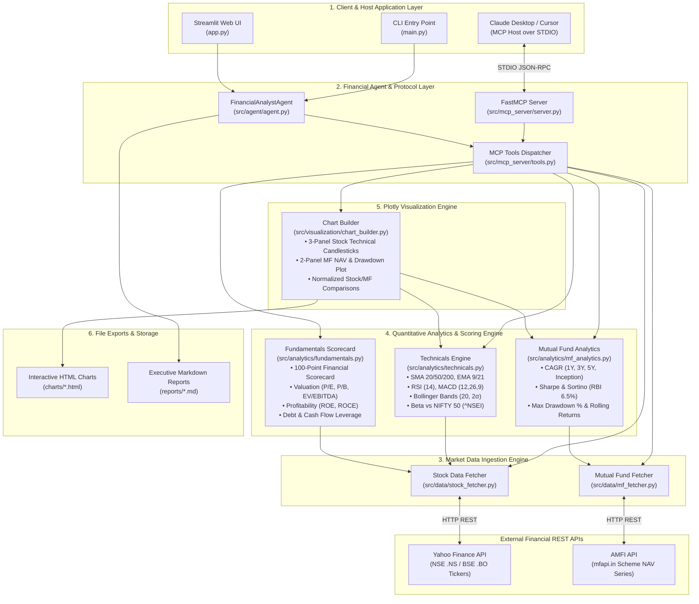

# Arthra MCP — End-to-End Comprehensive Architecture & Workflow Specification

This document provides an exhaustive, granular technical explanation of the end-to-end architecture, data flows, quantitative formulas, visualization engines, MCP tool handlers, and execution lifecycles of **Arthra MCP**.

---

## 1. Master System Architecture Flowchart



---

## 2. Sequence Diagram: Detailed Request Execution Lifecycle

```mermaid
sequenceDiagram
    autonumber
    actor User as User / Host App
    participant Agent as FinancialAnalystAgent
    participant Tools as MCP Tools (tools.py)
    participant StockEngine as Stock Ingestion (stock_fetcher)
    participant MFEngine as MF Ingestion (mf_fetcher)
    participant Quant as Analytics Engines (technicals/fundamentals/mf_analytics)
    participant Vis as Chart Builder (chart_builder)
    participant Disk as Local File Storage (charts/ & reports/)

    User->>Agent: Query ("Analyze Reliance Industries")
    Agent->>Tools: tool_search_indian_symbol("Reliance")
    Tools->>StockEngine: normalize_indian_symbol("Reliance")
    StockEngine-->>Tools: "RELIANCE.NS"
    Tools-->>Agent: {"resolvedStockSymbol": "RELIANCE.NS"}

    Agent->>Tools: tool_analyze_and_visualize("RELIANCE.NS", asset_type="stock", period="1y")
    
    rect rgb(30, 35, 45)
        Note over Tools, Quant: Quantitative Computation Phase
        Tools->>StockEngine: get_historical_ohlcv("RELIANCE.NS", period="2y") [Warmup Data]
        StockEngine-->>Tools: OHLCV DataFrame (500 candles)
        Tools->>Quant: get_full_technical_analysis(df)
        Quant-->>Tools: {RSI: 63.4, SMA20: 1295.4, MACD, Sentiment: "STRONG BULLISH"}
        Tools->>Quant: calculate_beta_and_volatility(df)
        Quant->>StockEngine: get_historical_ohlcv("^NSEI", period="1y")
        Quant-->>Tools: {Beta: 0.92, Volatility: 22.4%}
        Tools->>StockEngine: get_stock_fundamentals("RELIANCE.NS")
        StockEngine-->>Tools: Raw Financial Ratios
        Tools->>Quant: compute_financial_health_scorecard(raw_fund)
        Quant-->>Tools: {healthScore: 78/100, valuationStatus: "FAIR"}
    end

    rect rgb(40, 45, 55)
        Note over Tools, Vis: Visual Chart Generation Phase
        Tools->>Vis: build_stock_technical_chart("RELIANCE.NS", period="1y")
        Vis->>Disk: Save interactive HTML chart -> charts/RELIANCE_NS_technical.html
        Vis-->>Tools: "/path/to/charts/RELIANCE_NS_technical.html"
    end

    Tools-->>Agent: Complete JSON Payload + Chart File Path
    Agent->>Disk: Synthesize & Save Markdown Report -> reports/RELIANCE_NS_report.md
    Agent-->>User: Markdown Research Report + Interactive HTML Link
```



---

## 3. Component Deep Dive & Detailed Specifications

### Module 1: Indian Market Data Ingestion (`src/data/`)

#### A. Stock Fetcher (`src/data/stock_fetcher.py`)
- **Symbol Normalization**: Ensures Indian stock query inputs append `.NS` (National Stock Exchange) or `.BO` (Bombay Stock Exchange). If no suffix is passed, `.NS` is automatically appended.
- **Quote Ingestion (`get_stock_quote`)**: Fetches current price, previous close, percentage change, day high/low, 52-week high/low, volume, and total market capitalization.
- **Historical OHLCV (`get_historical_ohlcv`)**: Downloads historical Open, High, Low, Close, Volume price series via `yfinance` for specified durations (`1mo`, `3mo`, `6mo`, `1y`, `2y`, `5y`).
- **Fundamental Financials (`get_stock_fundamentals`)**: Retrieves valuation multiples (P/E, Forward P/E, P/B, EV/EBITDA), profitability margins (Profit Margin, Operating Margin), returns on capital (ROE, ROCE), debt ratios (Debt to Equity), and free cash flow.

#### B. Mutual Fund Fetcher (`src/data/mf_fetcher.py`)
- **AMFI Scheme Directory (`search_mutual_fund`)**: Queries the official AMFI database published via `mfapi.in` to resolve scheme names to 6-digit AMFI scheme codes (e.g. `122640` for Parag Parikh Flexi Cap Fund).
- **Historical NAV Series (`get_mutual_fund_nav_df`)**: Fetches full daily NAV history since inception, parses dates into standard datetime objects, converts NAV strings to float64, and sorts chronologically.

---

### Module 2: Quantitative Analytics Engine (`src/analytics/`)

#### A. Technical Analysis (`src/analytics/technicals.py`)
1. **Simple Moving Average (SMA)**:
   $$\text{SMA}_k = \frac{1}{k} \sum_{i=0}^{k-1} P_{t-i}$$
   Calculated for $k \in \{20, 50, 200\}$.
2. **Exponential Moving Average (EMA)**:
   $$\text{EMA}_t = P_t \times \left(\frac{2}{k+1}\right) + \text{EMA}_{t-1} \times \left(1 - \frac{2}{k+1}\right)$$
   Calculated for $k \in \{9, 21\}$.
3. **Relative Strength Index (RSI 14)**:
   $$\text{RS} = \frac{\text{Smoothed Average Gain}}{\text{Smoothed Average Loss}}, \quad \text{RSI} = 100 - \left(\frac{100}{1 + \text{RS}}\right)$$
   Evaluated over 14 trading days. Values $>70$ signal Overbought; $<30$ signal Oversold.
4. **MACD (Moving Average Convergence Divergence)**:
   $$\text{MACD Line} = \text{EMA}_{12}(P) - \text{EMA}_{26}(P)$$
   $$\text{Signal Line} = \text{EMA}_9(\text{MACD Line})$$
   $$\text{Histogram} = \text{MACD Line} - \text{Signal Line}$$
5. **Bollinger Bands (20, 2$\sigma$)**:
   $$\text{Middle Band} = \text{SMA}_{20}, \quad \text{Upper Band} = \text{SMA}_{20} + 2\sigma_{20}, \quad \text{Lower Band} = \text{SMA}_{20} - 2\sigma_{20}$$
6. **Beta & Volatility vs NIFTY 50 (`^NSEI`)**:
   $$\text{Volatility}_{\text{ann}} = \sigma_{\text{daily}} \times \sqrt{252}$$
   $$\beta = \frac{\text{Covariance}(R_{\text{stock}}, R_{\text{NIFTY}})}{\text{Variance}(R_{\text{NIFTY}})}$$

#### B. Fundamental Health Scorecard (`src/analytics/fundamentals.py`)
Computes a **100-Point Scorecard** evaluating:
- **Valuation Score (30 Pts)**: Trailing P/E vs sector average, Price to Book (P/B), EV/EBITDA ratio.
- **Profitability Score (30 Pts)**: Return on Equity ($\text{ROE} > 15\%$), Return on Capital Employed ($\text{ROCE} > 15\%$), Operating Margin $\%$.
- **Growth & Liquidity Score (20 Pts)**: Revenue growth, earnings growth, Quick Ratio.
- **Debt & Cash Flow Score (20 Pts)**: Debt-to-Equity ratio ($<1.0$), Free Cash Flow positivity.

#### C. Mutual Fund Risk Analytics (`src/analytics/mf_analytics.py`)
1. **Compound Annual Growth Rate (CAGR)**:
   $$\text{CAGR} = \left(\frac{\text{NAV}_{\text{end}}}{\text{NAV}_{\text{start}}}\right)^{\frac{1}{N}} - 1$$
2. **Sharpe Ratio** (vs RBI 6.5% T-Bill Risk-Free Rate):
   $$\text{Sharpe} = \frac{R_{\text{annualized}} - R_f}{\sigma_{\text{annualized}}}$$
3. **Sortino Ratio**:
   $$\text{Sortino} = \frac{R_{\text{annualized}} - R_f}{\sigma_{\text{downside}}}$$
4. **Maximum Drawdown (MDD)**:
   $$\text{Drawdown}_t = \frac{\text{NAV}_t - \text{Peak}_t}{\text{Peak}_t}, \quad \text{MDD} = \min_t(\text{Drawdown}_t)$$

---

### Module 3: Plotly Visualization Engine (`src/visualization/`)

- **Stock Technical Chart (`build_stock_technical_chart`)**:
  - **Subplot 1 (60% height)**: Candlestick price chart + SMA 20 + SMA 50 + SMA 200 + EMA 9 + EMA 21 + Bollinger Bands shaded area. Includes 2-year indicator warmup so line series span **100% full width** without left margin gaps.
  - **Subplot 2 (20% height)**: Purple RSI (14) line with 70 overbought and 30 oversold dashed threshold lines.
  - **Subplot 3 (20% height)**: MACD line (cyan), Signal line (orange), and color-coded histogram bars (green for positive, red for negative).

- **Mutual Fund Chart (`build_mutual_fund_chart`)**:
  - **Subplot 1 (70% height)**: Neon green historical NAV growth trajectory.
  - **Subplot 2 (30% height)**: Filled underwater drawdown percentage chart showing historical peak-to-trough drops.

- **Comparative Baseline Charts (`build_stock_comparison_chart` & `build_mutual_fund_comparison_chart`)**:
  - Normalizes prices to a $0.0\%$ baseline on Day 1:
    $$\text{Return}_t = \left(\frac{P_t}{P_0} - 1.0\right) \times 100\%$$
  - Plots asset return curves against NIFTY 50 benchmark (`^NSEI`) on the same axis.

---

### Module 4: FastMCP Server Protocol (`src/mcp_server/`)

Exposes standard JSON-RPC tools over STDIO:
1. `search_indian_symbol(query: str)`
2. `fetch_financial_data(symbol: str, data_type: str, period: str)`
3. `analyze_and_visualize(symbol: str, asset_type: str, period: str)`
4. `compare_assets(assets: List[str], asset_type: str, period: str)`

---

### Module 5: Financial Analyst Agent (`src/agent/`) & Web UI (`app.py`)

- **Agent Orchestrator**: Converts natural language prompts into tool executions and generates structured Markdown reports exported to `reports/`.
- **Streamlit Web Dashboard (`app.py`)**: Real-time web browser UI providing single stock analytics, mutual fund analytics, multi-asset comparisons, stock peer fundamental matrices, and AI agent chat interface.

---

## 4. File-by-File Dependency Graph

```text
app.py (Streamlit Web Dashboard UI)
 ├── src/data/stock_fetcher.py
 ├── src/data/mf_fetcher.py
 ├── src/analytics/technicals.py
 ├── src/analytics/fundamentals.py
 ├── src/analytics/mf_analytics.py
 └── src/agent/agent.py
      └── src/mcp_server/tools.py
           ├── src/data/stock_fetcher.py
           ├── src/data/mf_fetcher.py
           ├── src/analytics/technicals.py
           ├── src/analytics/fundamentals.py
           ├── src/analytics/mf_analytics.py
           └── src/visualization/chart_builder.py
```
