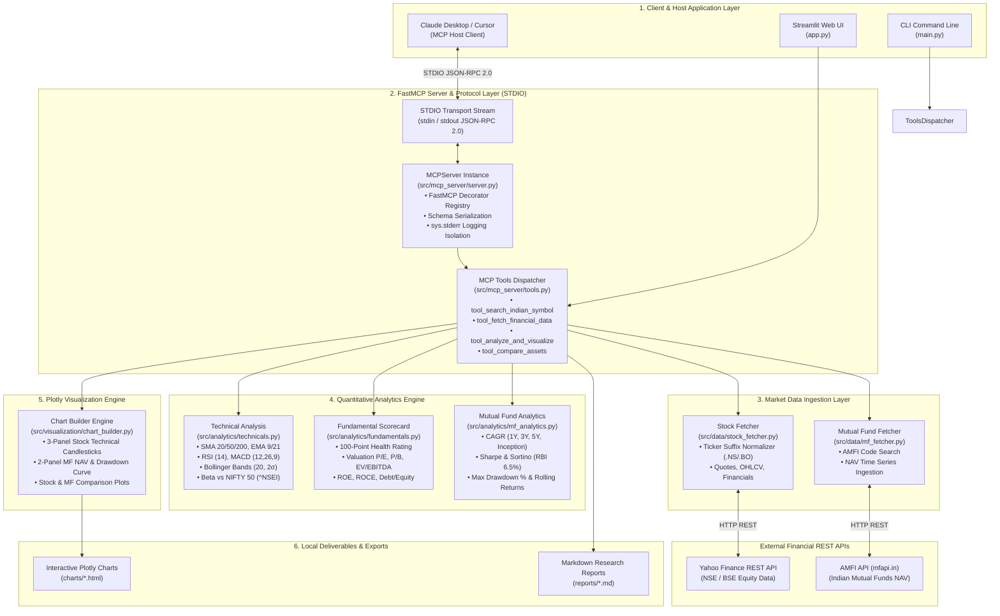

# Arthra MCP — Master Architecture, FastMCP Server Specification & File Registry

This document serves as the authoritative, end-to-end technical reference manual for **Arthra MCP**. It details every architectural layer, mathematical model, visualization pipeline, the **FastMCP Server JSON-RPC 2.0 protocol implementation**, and an exhaustive **file-by-file system registry**.

---

## 1. Master System Flowchart (Architecture Overview)



---

## 2. Sequence Diagram: FastMCP JSON-RPC Execution Cycle

```mermaid
sequenceDiagram
    autonumber
    participant Host as Host Client (Claude Desktop / Cursor)
    participant Server as FastMCP Server (server.py)
    participant Dispatcher as Tools Dispatcher (tools.py)
    participant Data as Data Ingestion (stock_fetcher / mf_fetcher)
    participant Quant as Analytics Modules (technicals / fundamentals / mf_analytics)
    participant Vis as Plotly Visualizer (chart_builder)

    Note over Host, Server: Phase A: Capability Discovery & Registration
    Host->>Server: JSON-RPC request: {"jsonrpc":"2.0", "method":"tools/list", "id":1}
    Server-->>Host: JSON-RPC response: Tool Schemas (names, docstrings, JSON parameters)

    Note over Host, Server: Phase B: Tool Execution Request
    Host->>Server: JSON-RPC request: {"jsonrpc":"2.0", "method":"tools/call", "params":{"name":"analyze_and_visualize", "arguments":{"symbol":"TCS", "asset_type":"stock"}}, "id":2}
    
    Server->>Dispatcher: Call tool_analyze_and_visualize(symbol="TCS", asset_type="stock")
    
    rect rgb(30, 35, 45)
        Note over Dispatcher, Quant: Data Fetching & Quantitative Analysis
        Dispatcher->>Data: normalize_indian_symbol("TCS") -> "TCS.NS"
        Dispatcher->>Data: get_historical_ohlcv("TCS.NS", period="2y") [Warmup Data]
        Data-->>Dispatcher: DataFrame (500 candles)
        Dispatcher->>Quant: get_full_technical_analysis(df)
        Quant-->>Dispatcher: Technicals Dict (RSI: 63.38, Sentiment: "STRONG BULLISH")
        Dispatcher->>Data: get_stock_fundamentals("TCS.NS")
        Data-->>Dispatcher: Fundamental Ratios Dict
        Dispatcher->>Quant: compute_financial_health_scorecard(raw_fund)
        Quant-->>Dispatcher: Scorecard Dict (healthScore: 100/100)
    end

    rect rgb(40, 45, 55)
        Note over Dispatcher, Vis: Plotly HTML Chart Rendering
        Dispatcher->>Vis: build_stock_technical_chart("TCS.NS", period="1y")
        Vis-->>Dispatcher: Chart path "/.../charts/TCS_NS_technical.html"
    end

    Dispatcher-->>Server: Final Result Dictionary
    Server-->>Host: JSON-RPC response: {"jsonrpc":"2.0", "result":{"content":[{"type":"text", "text":"{...JSON Payload...}"}]}, "id":2}
```



---

## 3. FastMCP Server & Protocol Deep Dive (`src/mcp_server/`)

### A. How FastMCP Works Under the Hood

The Model Context Protocol (MCP) uses a client-server architecture. In Arthra MCP, the server is built using the official Python SDK's `MCPServer` class (`mcp.server.mcpserver`).

#### 1. STDIO Transport Isolation
- The server communicates via **Standard Input (stdin)** and **Standard Output (stdout)** streams.
- **Critical Requirement**: `stdout` MUST contain ONLY valid JSON-RPC 2.0 frames. Any raw `print()` statements outputting to `stdout` will corrupt the JSON stream and crash the client connection.
- **Implementation Guarantee**: In `src/mcp_server/server.py`, logging is strictly redirected to Standard Error (`sys.stderr`):
  ```python
  logging.basicConfig(level=logging.INFO, stream=sys.stderr)
  ```

#### 2. Automatic Tool Registration & Schema Generation
When decorators like `@mcp.tool()` are added to functions in `src/mcp_server/server.py`:
```python
@mcp.tool()
def analyze_and_visualize(
    symbol: str, asset_type: str = "stock", period: str = "1y", generate_chart: bool = True
) -> Dict[str, Any]:
    """
    Runs quantitative technical/fundamental/MF risk analysis AND generates interactive Plotly HTML chart.
    """
    return tool_analyze_and_visualize(symbol, asset_type=asset_type, period=period, generate_chart=generate_chart)
```
The FastMCP engine inspects function type annotations (`symbol: str`, `period: str`, `generate_chart: bool`) and function docstrings to generate an OpenAPI-compliant JSON Schema sent to Claude/Cursor during tool discovery (`tools/list`).

---

### B. Registered FastMCP Tools Specification

#### Tool 1: `search_indian_symbol`
- **Purpose**: Resolves company names to NSE/BSE ticker symbols or searches AMFI Mutual Fund scheme codes.
- **Input Parameters**:
  - `query` (`string`, required): Search string (e.g., `"RELIANCE"`, `"TCS"`, `"Parag Parikh"`).
- **Return JSON Structure**:
  ```json
  {
    "query": "Parag Parikh",
    "resolvedStockSymbol": null,
    "stockQuoteSummary": null,
    "mutualFundMatches": [
      {
        "schemeCode": 122640,
        "schemeName": "Parag Parikh Flexi Cap Fund - Regular Plan - Growth"
      }
    ]
  }
  ```

#### Tool 2: `fetch_financial_data`
- **Purpose**: Fetches raw market quotes, historical OHLCV data, stock fundamental ratios, balance sheets, or mutual fund NAV series.
- **Input Parameters**:
  - `symbol` (`string`, required): Stock symbol (`"TCS"`) or Scheme Code (`"122640"`).
  - `data_type` (`string`, optional): `"stock"`, `"mutual_fund"`, `"fundamentals"`, or `"financials"`.
  - `period` (`string`, optional): Timeframe (`"1mo"`, `"3mo"`, `"6mo"`, `"1y"`, `"2y"`, `"5y"`).

#### Tool 3: `analyze_and_visualize`
- **Purpose**: Executes quantitative analysis (SMA, EMA, RSI, MACD, Beta vs NIFTY 50, 100-point fundamental scorecard, or MF CAGR/Sharpe/Sortino/Drawdowns) AND generates interactive dark-mode Plotly HTML charts saved to `charts/`.
- **Input Parameters**:
  - `symbol` (`string`, required): Ticker (`"RELIANCE"`) or Scheme Code (`"122640"`).
  - `asset_type` (`string`, optional): `"stock"` or `"mutual_fund"`.
  - `period` (`string`, optional): `"3mo"`, `"6mo"`, `"1y"`, `"2y"`, `"5y"`.
  - `generate_chart` (`boolean`, optional): Default `true`.

#### Tool 4: `compare_assets`
- **Purpose**: Compares performance of multiple stocks or mutual funds normalized against NIFTY 50 benchmark on a $0.0\%$ baseline.
- **Input Parameters**:
  - `assets` (`array of strings`, required): e.g. `["RELIANCE", "TCS", "HDFCBANK"]`.
  - `asset_type` (`string`, optional): `"stock"` or `"mutual_fund"`.
  - `period` (`string`, optional): `"3mo"`, `"6mo"`, `"1y"`, `"3y"`, `"5y"`.

---

## 4. Comprehensive File-by-File System Registry ("Which File Does What")

Below is the complete breakdown of **every single file in the project repository**, detailing its exact filepath, purpose, main functions/classes, dependencies, and operational responsibilities:

### 📁 Core Source Package (`src/`)

#### 1. Data Ingestion Layer (`src/data/`)
- **[src/data/__init__.py](file:///Users/anshkapoor/Desktop/projects/mcp_financal_analyst/src/data/__init__.py)**
  - *Purpose*: Package initialization file making `src.data` a Python module.
- **[src/data/stock_fetcher.py](file:///Users/anshkapoor/Desktop/projects/mcp_financal_analyst/src/data/stock_fetcher.py)** (Total Lines: 175)
  - *Purpose*: Fetches equity market data for Indian stocks listed on National Stock Exchange (NSE) and Bombay Stock Exchange (BSE) via `yfinance`.
  - *Key Functions*:
    - `normalize_indian_symbol(symbol: str) -> str`: Appends `.NS` or `.BO` suffix if missing (e.g. `RELIANCE` $\rightarrow$ `RELIANCE.NS`).
    - `get_stock_quote(symbol: str) -> Dict`: Retrieves current price, day high/low, 52-week high/low, market cap, and volume.
    - `get_historical_ohlcv(symbol: str, period: str, interval: str) -> pd.DataFrame`: Ingests Open-High-Low-Close-Volume price history dataframe.
    - `get_stock_fundamentals(symbol: str) -> Dict`: Retrieves valuation ratios (P/E, P/B, EV/EBITDA), profitability (ROE, ROCE), and balance sheet data.
    - `get_financial_statements(symbol: str) -> Dict`: Fetches income statement, balance sheet, and cash flow statement DataFrames.
- **[src/data/mf_fetcher.py](file:///Users/anshkapoor/Desktop/projects/mcp_financal_analyst/src/data/mf_fetcher.py)** (Total Lines: 125)
  - *Purpose*: Interacts with the official AMFI database via `mfapi.in` REST API to fetch Indian Mutual Fund data.
  - *Key Functions*:
    - `search_mutual_fund(query: str) -> List[Dict]`: Performs fuzzy scheme name search across all Indian AMFI mutual fund schemes.
    - `get_mutual_fund_details(scheme_code: str) -> Dict`: Fetches scheme details, fund house, category, scheme type, and latest NAV.
    - `get_mutual_fund_nav_df(scheme_code: str) -> pd.DataFrame`: Ingests complete historical daily NAV series as a clean pandas DataFrame sorted by date.

#### 2. Quantitative Analytics Engine (`src/analytics/`)
- **[src/analytics/__init__.py](file:///Users/anshkapoor/Desktop/projects/mcp_financal_analyst/src/analytics/__init__.py)**
  - *Purpose*: Package initialization file for `src.analytics`.
- **[src/analytics/technicals.py](file:///Users/anshkapoor/Desktop/projects/mcp_financal_analyst/src/analytics/technicals.py)** (Total Lines: 242)
  - *Purpose*: Mathematical calculation engine for technical indicators, moving averages, momentum oscillators, and Beta.
  - *Key Functions*:
    - `calculate_sma(df, window, column) -> pd.Series`: Simple Moving Average.
    - `calculate_ema(df, window, column) -> pd.Series`: Exponential Moving Average.
    - `calculate_rsi(df, window) -> pd.Series`: Relative Strength Index (RSI 14).
    - `calculate_macd(df, fast, slow, signal) -> Dict[str, pd.Series]`: MACD Line, Signal Line, and Histogram.
    - `calculate_bollinger_bands(df, window, num_std) -> Dict[str, pd.Series]`: Bollinger Upper & Lower Bands.
    - `calculate_beta_and_volatility(df_stock, benchmark_symbol) -> Dict`: Computes annualized volatility % and Beta relative to NIFTY 50 (`^NSEI`).
    - `get_full_technical_analysis(df) -> Dict`: Combines all indicators and synthesizes overall technical sentiment (`STRONG BULLISH`, `BULLISH`, `NEUTRAL`, `BEARISH`).
- **[src/analytics/fundamentals.py](file:///Users/anshkapoor/Desktop/projects/mcp_financal_analyst/src/analytics/fundamentals.py)** (Total Lines: 120)
  - *Purpose*: Computes a comprehensive 100-Point Financial Health Scorecard for stocks.
  - *Key Functions*:
    - `compute_financial_health_scorecard(fundamentals_dict) -> Dict`: Evaluates Valuation (30 pts), Profitability (30 pts), Growth (20 pts), and Financial Leverage (20 pts), returning an overall score out of 100 and rating (`STRONG FUNDAMENTALS`, `MODERATE / FAIR`, `WEAK`).
- **[src/analytics/mf_analytics.py](file:///Users/anshkapoor/Desktop/projects/mcp_financal_analyst/src/analytics/mf_analytics.py)** (Total Lines: 145)
  - *Purpose*: Evaluates risk-adjusted performance for Indian Mutual Funds.
  - *Key Functions*:
    - `analyze_mutual_fund_performance(nav_df, risk_free_rate) -> Dict`: Calculates CAGR (1Y, 3Y, 5Y, Inception), Sharpe Ratio, Sortino Ratio (vs RBI 6.5% T-Bill benchmark), Annualized Volatility, Maximum Drawdown %, and 1-Year Rolling Returns.

#### 3. Plotly Visualization Engine (`src/visualization/`)
- **[src/visualization/__init__.py](file:///Users/anshkapoor/Desktop/projects/mcp_financal_analyst/src/visualization/__init__.py)**
  - *Purpose*: Package initialization file for `src.visualization`.
- **[src/visualization/chart_builder.py](file:///Users/anshkapoor/Desktop/projects/mcp_financal_analyst/src/visualization/chart_builder.py)** (Total Lines: 398)
  - *Purpose*: Generates interactive dark-mode Plotly HTML charts with 2-year indicator warmup logic.
  - *Key Functions*:
    - `build_stock_technical_chart(ticker_symbol, period, save_filename) -> str`: Generates 3-panel Stock Technical chart (Candlesticks + MAs + Bollinger Bands / RSI 14 / MACD).
    - `build_mutual_fund_chart(scheme_code, save_filename) -> str`: Generates 2-panel Mutual Fund chart (NAV Curve / Underwater Drawdown %).
    - `build_stock_comparison_chart(stock_dict, period, save_filename) -> str`: Generates Stock vs Stock comparison chart vs NIFTY 50 benchmark on normalized 0% baseline.
    - `build_mutual_fund_comparison_chart(mf_dict, period, save_filename) -> str`: Generates Mutual Fund vs Mutual Fund comparison chart vs NIFTY 50 benchmark on normalized 0% baseline.

#### 4. FastMCP Server Protocol Layer (`src/mcp_server/`)
- **[src/mcp_server/__init__.py](file:///Users/anshkapoor/Desktop/projects/mcp_financal_analyst/src/mcp_server/__init__.py)**
  - *Purpose*: Package initialization file for `src.mcp_server`.
- **[src/mcp_server/tools.py](file:///Users/anshkapoor/Desktop/projects/mcp_financal_analyst/src/mcp_server/tools.py)** (Total Lines: 219)
  - *Purpose*: Contains handler functions bridging MCP tool invocations with underlying fetcher, analytics, and visualization modules.
  - *Key Functions*: `tool_search_indian_symbol()`, `tool_fetch_financial_data()`, `tool_analyze_and_visualize()`, `tool_compare_assets()`.
- **[src/mcp_server/server.py](file:///Users/anshkapoor/Desktop/projects/mcp_financal_analyst/src/mcp_server/server.py)** (Total Lines: 85)
  - *Purpose*: Configures FastMCP `MCPServer` instance over STDIO, registers `@mcp.tool()` decorators, and executes `run_server()`.

#### 5. Financial Analyst Agent (`src/agent/`)
- **[src/agent/__init__.py](file:///Users/anshkapoor/Desktop/projects/mcp_financal_analyst/src/agent/__init__.py)**
  - *Purpose*: Package initialization file for `src.agent`.
- **[src/agent/agent.py](file:///Users/anshkapoor/Desktop/projects/mcp_financal_analyst/src/agent/agent.py)** (Total Lines: 235)
  - *Purpose*: `FinancialAnalystAgent` class orchestrating natural language query resolution, stock/MF research execution, and markdown research report synthesis exported to `reports/`.

---

### 📁 Application Entry Points & User Interfaces

- **[main.py](file:///Users/anshkapoor/Desktop/projects/mcp_financal_analyst/main.py)** (Total Lines: 85)
  - *Purpose*: Command-Line Interface (CLI) entry point supporting flags:
    - `--server`: Launches FastMCP server over STDIO.
    - `--agent "<query>"`: Executes natural language agent query.
    - `--stock <ticker>`: Runs stock research.
    - `--mf <code_or_name>`: Runs mutual fund research.
- **[app.py](file:///Users/anshkapoor/Desktop/projects/mcp_financal_analyst/app.py)** (Total Lines: 495)
  - *Purpose*: Streamlit Web Dashboard UI containing 5 interactive modules:
    1. 📊 Indian Equity Stock Analysis
    2. 🏦 Mutual Fund Analysis
    3. ⚡ Multi-Asset Comparison
    4. 🏢 Stock Peer Fundamental Comparison Matrix
    5. 🤖 AI Financial Agent Chat

---

### 📁 Test Suites (`tests/`)

- **[tests/test_data_fetchers.py](file:///Users/anshkapoor/Desktop/projects/mcp_financal_analyst/tests/test_data_fetchers.py)**: Tests ticker normalization, stock quote fetching, OHLCV dataframes, fundamentals, and AMFI mutual fund APIs.
- **[tests/test_analytics.py](file:///Users/anshkapoor/Desktop/projects/mcp_financal_analyst/tests/test_analytics.py)**: Tests SMA, EMA, RSI, MACD, Bollinger Bands, Beta vs NIFTY 50, 100-pt scorecard, and MF CAGR/Sharpe.
- **[tests/test_visualization.py](file:///Users/anshkapoor/Desktop/projects/mcp_financal_analyst/tests/test_visualization.py)**: Tests Plotly HTML chart generation and output file paths.
- **[tests/test_mcp_server.py](file:///Users/anshkapoor/Desktop/projects/mcp_financal_analyst/tests/test_mcp_server.py)**: Tests FastMCP server instantiation and tool execution handlers.
- **[tests/test_agent.py](file:///Users/anshkapoor/Desktop/projects/mcp_financal_analyst/tests/test_agent.py)**: Tests agent intent parsing and Markdown report generation.

---

### 📁 Demonstration Client Scripts (`demo_client/`)

- **[demo_client/demo_data.py](file:///Users/anshkapoor/Desktop/projects/mcp_financal_analyst/demo_client/demo_data.py)**: Demonstrates Phase 2 raw stock and mutual fund data fetching.
- **[demo_client/demo_analytics.py](file:///Users/anshkapoor/Desktop/projects/mcp_financal_analyst/demo_client/demo_analytics.py)**: Demonstrates Phase 3 quantitative technicals, fundamental scorecards, and MF risk analytics.
- **[demo_client/demo_visualization.py](file:///Users/anshkapoor/Desktop/projects/mcp_financal_analyst/demo_client/demo_visualization.py)**: Demonstrates Phase 4 Plotly HTML chart generation.
- **[demo_client/demo_mcp_server.py](file:///Users/anshkapoor/Desktop/projects/mcp_financal_analyst/demo_client/demo_mcp_server.py)**: Demonstrates Phase 5 FastMCP tool calls.
- **[demo_client/demo_agent.py](file:///Users/anshkapoor/Desktop/projects/mcp_financal_analyst/demo_client/demo_agent.py)**: Demonstrates Phase 6 Agent report synthesis.

---

### 📁 Documentation Suite (`docs/`)

- **[docs/info.txt](file:///Users/anshkapoor/Desktop/projects/mcp_financal_analyst/docs/info.txt)**: Core project vision, goals, and documentation index.
- **[docs/plan.md](file:///Users/anshkapoor/Desktop/projects/mcp_financal_analyst/docs/plan.md)**: Master 7-phase architecture plan and flowcharts.
- **[docs/phase_1.md](file:///Users/anshkapoor/Desktop/projects/mcp_financal_analyst/docs/phase_1.md)**: Phase 1 Environment & Architecture documentation.
- **[docs/phase_2.md](file:///Users/anshkapoor/Desktop/projects/mcp_financal_analyst/docs/phase_2.md)**: Phase 2 Data Ingestion documentation.
- **[docs/phase_3.md](file:///Users/anshkapoor/Desktop/projects/mcp_financal_analyst/docs/phase_3.md)**: Phase 3 Quantitative Engine documentation.
- **[docs/phase_4.md](file:///Users/anshkapoor/Desktop/projects/mcp_financal_analyst/docs/phase_4.md)**: Phase 4 Plotly Visualization documentation.
- **[docs/phase_5.md](file:///Users/anshkapoor/Desktop/projects/mcp_financal_analyst/docs/phase_5.md)**: Phase 5 FastMCP Server documentation.
- **[docs/phase_6.md](file:///Users/anshkapoor/Desktop/projects/mcp_financal_analyst/docs/phase_6.md)**: Phase 6 Financial Analyst Agent documentation.
- **[docs/phase_7.md](file:///Users/anshkapoor/Desktop/projects/mcp_financal_analyst/docs/phase_7.md)**: Phase 7 Testing & Verification documentation.
- **[docs/full_project_flow.md](file:///Users/anshkapoor/Desktop/projects/mcp_financal_analyst/docs/full_project_flow.md)**: Exhaustive master documentation (this file).
