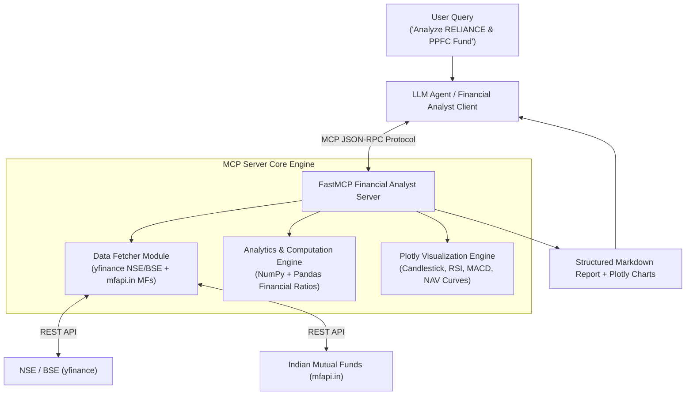
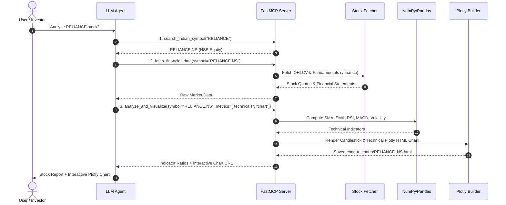
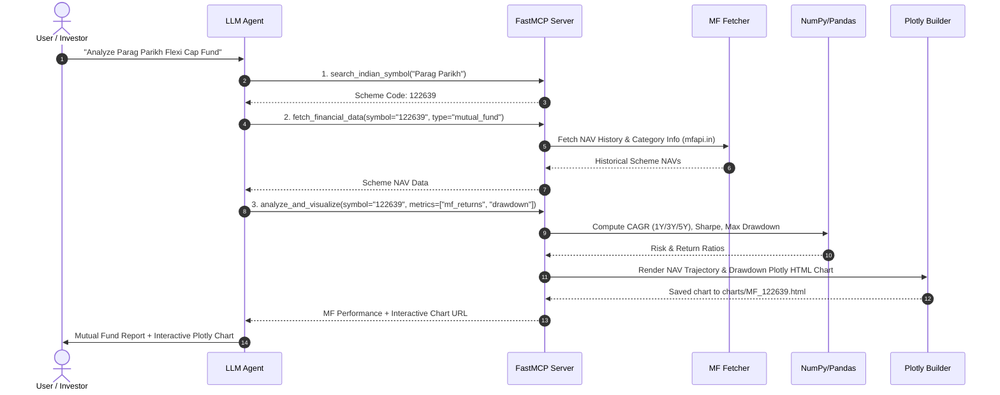
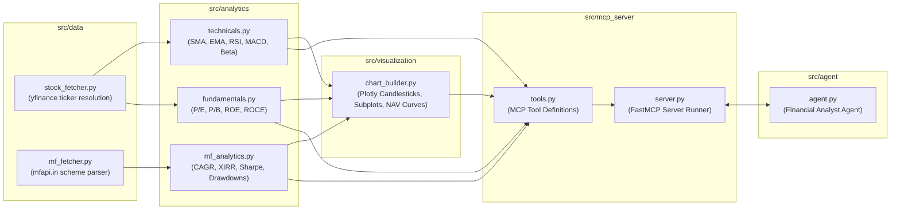
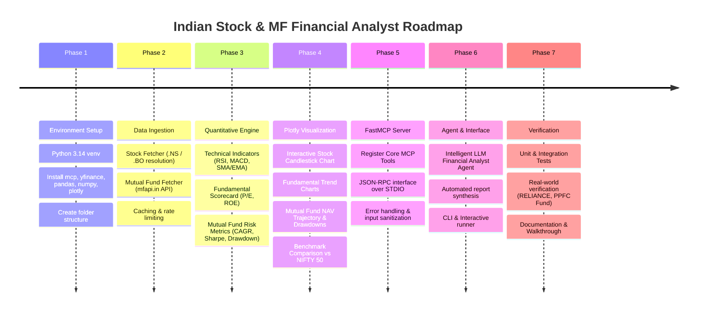

# Arthra MCP: Indian Stock & Mutual Fund Financial Analyst System

Build **Arthra MCP** — an automated, local **Financial Analyst System powered by Model Context Protocol (MCP)** tailored specifically for **Indian Equity (NSE/BSE)** and **Indian Mutual Funds (AMFI)**.

The architecture follows the user workflow model: an **LLM Agent** invoking **MCP Tools** backed by financial data APIs (`yfinance`, `mfapi.in`), quantitative computation engines (`NumPy`, `Pandas`), and interactive visualization engines (`Plotly`).

---

## 1. High-Level Architecture Flow

---

## 2A. Stock Analysis Sequence Flow

---

## 2B. Mutual Fund Analysis Sequence Flow

---

## 3. Modular System Architecture

---

## 4. Phase-Wise Execution Roadmap

---

## Technical Highlights
- **Data Source**: Stocks via `yfinance` with `.NS` (NSE) and `.BO` (BSE) ticker extensions (e.g. `RELIANCE.NS`, `TCS.NS`, `HDFCBANK.NS`). Mutual Funds via free public AMFI API (`mfapi.in`) for all Indian Mutual Fund scheme NAVs & historical performance.
- **Protocol**: Built using official Python `mcp` / `FastMCP` framework for seamless integration with Claude Desktop, Cursor, Custom LLM Agents, or CLI clients.
- **Visuals**: Interactive Plotly Candlestick charts, Technical Indicators (RSI, MACD, Moving Averages, Bollinger Bands), Mutual Fund NAV performance curves, and asset comparison charts.

---

## Phase Breakdown & File Mapping

### Phase 1: Environment & Architecture Setup
- Initialize Python virtual environment (`.venv`).
- Install core packages: `mcp`, `yfinance`, `pandas`, `numpy`, `plotly`, `requests`, `python-dotenv`.
- Set up directory structure:
  - `src/data/`: Stock & Mutual Fund data fetchers
  - `src/analytics/`: Technical, fundamental & mutual fund metrics engines
  - `src/visualization/`: Plotly chart builder module
  - `src/mcp_server/`: FastMCP server implementation & tool definitions
  - `src/agent/`: LLM Financial Analyst agent runner & prompt interface
  - `reports/` & `charts/`: Output directory for generated reports and visual HTML charts

### Phase 2: Indian Stock & Mutual Fund Data Ingestion Engine
- Implement `src/data/stock_fetcher.py`:
  - NSE/BSE ticker resolver (`RELIANCE` -> `RELIANCE.NS`).
  - Historical OHLCV, real-time quote, valuation ratios, balance sheet, income statement, cash flow statement.
- Implement `src/data/mf_fetcher.py`:
  - Scheme search by name via `mfapi.in` (e.g., "Parag Parikh Flexi Cap").
  - NAV history fetcher & scheme metadata extraction (Category, Fund House).

### Phase 3: Financial Analytics & Quantitative Engine
- Implement `src/analytics/technicals.py`:
  - Moving Averages (SMA 20/50/200, EMA 9/21).
  - RSI (14), MACD (12, 26, 9), Bollinger Bands.
  - Beta calculation relative to NIFTY 50 (`^NSEI`).
- Implement `src/analytics/fundamentals.py`:
  - Valuation metrics (P/E, P/B, EV/EBITDA), profitability (ROE, ROCE), financial strength score.
- Implement `src/analytics/mf_analytics.py`:
  - CAGR (1Y, 3Y, 5Y, Since Inception), Rolling Returns, Volatility, Sharpe Ratio, Sortino Ratio, Maximum Drawdown.

### Phase 4: Plotly Visualization Engine
- Implement `src/visualization/chart_builder.py`:
  - Stock Candlestick chart with volume, SMA/EMA overlays, RSI & MACD subplots.
  - Stock fundamental trend charts (Revenue, Earnings, P/E band).
  - Mutual Fund NAV trajectory & drawdown plots.
  - Multi-asset relative return comparison chart against NIFTY 50 benchmark.
  - Interactive HTML file export & display.

### Phase 5: MCP Server Implementation (FastMCP)
- Implement `src/mcp_server/server.py` & `src/mcp_server/tools.py`:
  - Register tools:
    1. `search_indian_symbol`: Resolve stock ticker or mutual fund scheme code.
    2. `fetch_financial_data`: Pull stock prices / mutual fund NAVs / financials.
    3. `analyze_and_visualize`: Run calculations (technicals, rolling averages, CAGR, Sharpe) and generate Plotly charts.
    4. `compare_assets`: Side-by-side performance comparison of Indian stocks/MFs.

### Phase 6: Financial Analyst Agent & Interactive Interface
- Implement `src/agent/agent.py`:
  - Intelligent financial agent using MCP tools.
  - Formats natural language questions into structured tools calls and synthesizes comprehensive research reports with embedded Plotly charts.
- Implement `main.py`: Main CLI entry point to launch MCP server or run agent commands.

### Phase 7: Testing, Verification & Walkthrough
- Test suite with real Indian stock symbols (`RELIANCE.NS`, `TCS.NS`) and mutual funds (`Parag Parikh Flexi Cap`).
- Generate sample reports and HTML chart artifacts.
- Create user documentation in `README.md` and complete project walkthrough.
